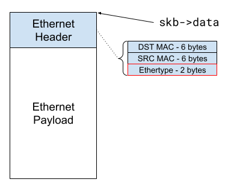
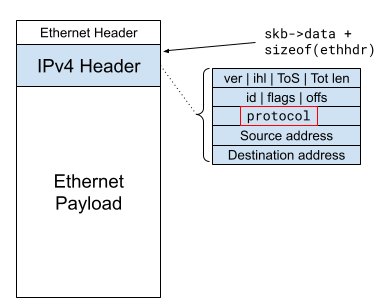
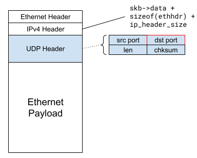
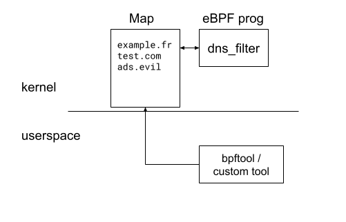

# Setup

## Requirements

## Using the orivded Vrirtual Machine

# Basic program

## Hello, world

Let's start simple with a "hello world" program. This will be the occasion to
get familiar with the process of compiling and loading a program, as well as
reading log messages from running eBPF programs.

go in the `src` folder, and let's start our journey by creating our program.

A common practise is to name eBPF programs `<name>.bpf.c`, so name the program
`dns-filter.bpf.c`.

Open it in your favorite text editor, and add the basic skeleton :

```
#include <linux/bpf.h>
#include <linux/if_ether.h>
#include <linux/in.h>
#include <linux/ip.h>
#include <linux/ipv6.h>
#include <linux/udp.h>
#include <linux/pkt_cls.h>
#include "bpf/bpf_helpers.h"
#include "bpf/bpf_endian.h"

SEC("tc")
int dns_filter(struct __sk_buff *skb)
{
    return TC_ACT_OK;
}

char __license[] SEC("license") = "GPL";
```

The `SEC` macro defines the ELF section in which the program is going to be
stored in the final object file, we need it to be stored in the "tc" section.

The `dns_filter` function is our program's entry point. This function will be
executed every time we send a packet ! It takes as a parameter a `struct __sk_buff`
object, that represents the content of our packet. The definition of the struct
can be found here (link).

If the function returns `TC_ACT_OK`, it means that we allow the packet to be sent.
To drop a packet, we simply need to return `TC_ACT_SHOT` instead. There are more
actions that can be returned, you can see the full list here (link).

For now, we just want to make sure that we are able to compile and load an eBPF
program and attach it to the TC hook. We however want know that our program is
working, and what better option than to print a nice "hello, world!" !

The main logging function in eBPF is `bpf_trace_printk`, but it's a bit cumbersome
to use as we have to declare the format string on the stack ahead of time :

```
const char fmt[] = "Hello, world\n";

bpf_trace_printk(fmt, sizeof(fmt));
```

A wrapper macro named `bpf_printk` is provided by libbpf, which makes it more
convenient to use. Insert the following line above the `return` statement:

```
    bpf_printk("Hello, world !\n");
```

To compile our program, we'll use Clang from the LLVM tools :

```
clang -g -O2 -target bpf -c dns_filter.bpf.c -o dns_filter.bpf.o
```

Congratulations, you have produced your first eBPF binary !

## Hello, traffic control

To load our first program, we'll use the tc command to create a new filter,
and attach our program to it.

```
tc qdisc add dev <interface> clsact
tc filter add dev <interface> egress bpf direct-action object-file dns_filter.bpf.o sec tc
```

Let's check the trace for our logs :

```
bpftool prog tracelog
```

You should now see all your hello world when your machine sends traffic to the
outside world ! What we will want to do next is identify, among all these packets,
the ones that correspond to DNS requests towards unwanted domains, and drop them.

When you'll want to remove a loaded program, the easiest way is to remove the
`clsact` qdisc entirely :

```
 tc qdisc del dev <interface> clsact
```

[Solution](correction/01_hello_world)

# Identify IP frames

The first step in our journey to identify DNS requests will be to first identify
ethernet frames that contain IP packets. The `skb` that is passed to our program
contains a field named `data`, that is a pointer to the beginning of the data we
want to send over the network. Even if we may want to send this frame over a
wireless network, our frame starts with an Ethernet Header :



To fetch data from our `skb`, we'll use the bpf helper `bpf_skb_load_bytes` :

```
long bpf_skb_load_bytes(const void *skb, u32 offset, void *to, u32 len)
```

This function returns 0 on success.

It's common when accessing data from the header of a packet to load it into a
C struct that maps each field directly. For example, there exists a `struct ethhdr`
provided by `<linux/if_ether.h>` that directly maps an ethernet header :

```
struct ethhdr {
	unsigned char	h_dest[ETH_ALEN];	/* destination eth addr	*/
	unsigned char	h_source[ETH_ALEN];	/* source ether addr	*/
	__be16		h_proto;		/* packet type ID field	*/
}

```

In your eBPF program, declare an object of type `struct ethhdr`, and fill it
with the content of the Ethernet header :

```
struct ethhdr ethhdr;
int ret;

ret = bpf_skb_load_bytes(skb, 0, &ethhdr, sizeof(ethhdr));
if (ret)
    return TC_ACT_OK;
```

It is _very_ important to check the return codes from the BPF helpers. If you
don't, the verifier may refuse to load the program altogether.

Now that we have the Ethernet header accessible, we need to check if it contains
either an IPv4 header, or an IPv6 header. This information is accessible in the
`h_proto` field of the ethernet header, however it is stored in "Network Endianness".

This is a Big Endian representation of the data, which needs to be converted
back to the "Native Endianness" of our CPU. This is done by using the helper
`__bpf_constant_htons` :

```
if (ethhdr.h_proto == __bpf_constant_htons(ETH_P_IP) {
    ...
}
```

The values in the `h_proto` field are called "Ethertype", and are defined as part
of ieee standard :

https://standards-oui.ieee.org/ethertype/eth.txt

There are macros provided by the C library that wraps these, that you can find
here (link). For example, IPv4 packets are mapped to the `ETH_P_IP` macro.

Update your program to pass any packet that isn't IPv4 or IPv6, as we are only
going to consider these types.

[Solution](correction/02_ethernet_header)

# Identify UDP packets

At that point, we either have an IPv4 packet, or an IPv6 one. Both of these
can encapsulate UDP, which we're interested in as this is what conveys DNS
requests.

IPv4 and IPv6 are represented respectively by `struct iphdr` and `struct ipv6hdr`.

In a similar fashion to the previous step, IPv4 headers have information about
wether they encapsulate TCP, UDP or something else in the "proto" field. For IPv6,
this is stored in the "next header" field :



To map the IPv4 or IPv6 headers, you need to skip the Ethernet header while
loading the IP header :

```
# IPv4 header mapping
ret = bpf_skb_load_bytes(skb, ETH_HLEN,  &iph, sizeof(iph));
if (ret)
    return TC_ACT_OK;
```

From that point on, we'll have to start managing the current offset for the
various headers we are parsing. This is especially true because IPv4 and IPv6
headers have a different length.

Let's declare a `unsgined int offset` variable and store the offset of the next data to
parse in it :

```
unsigned int offset = 0;
char l4_proto;

/* ... Ethernet header extraction ... */

offset += sizeof(ethhdr);

/* ... IP header extraction ... */

if ( /* ipv4 */) {
    /* ... Load IPv4 header ... */
    offset += sizeof(iphdr);

    l4_proto = iphdr.protocol;

} else if ( /* IPv6 */) {
    /* ... Load IPv6 header ... */
    offset += sizeof(ipv6hdr);

    l4_proto = ipv6hdr.nexthdr;
} else {
    return TC_ACT_OK;
}

if (l4_proto != IPPROTO_UDP)
    return TC_ACT_OK;
```

[Solution](correction/03_ip_header)

# Identify DNS datagrams

DNS acts on port 53. Let's do the dance once again of loading the UDP header in
the corresponding C structure `struct udphdr`, whose definition can be found [here](https://elixir.bootlin.com/linux/v6.17.7/source/include/uapi/linux/udp.h#L23)

Add a check for port 53, keeping in mind that the port field is a 2 byte value
in network endianness !



After passing everything that isn't port 53, don't forget to update our `offset`
variable.

[Solution](correction/04_udp_header)

# Identify DNS requests

We have finally written a BPF program that only cares about DNS datagrams, but
we're not done yet :) The DNS protocol supports numerous packet types, and we
need to identify the relevant ones for filtering.

A DNS query has the following header :

```
/* __be16 means that the field is a 16-bits Big Endian value */
struct dnshdr {
        __be16 trans_id;
        __be16 flags;
        __be16 nr_quest;
        __be16 nr_answ;
        __be16 nr_auth_rr;
        __be16 add_rr;
};
```

What we now want is to identify "DNS Queries". This information is
stored in the `flags` field, more specifically in the bit 0 of this 
entry. The semantics of this bit :

 - 0 if this is a DNS query
 - 1 if this is a DNS response

Return `TC_ACT_OK` for response.

[Solution](correction/05_dns_header)

# Extract the DNS query

Finally, the interesting part ! We are now going to extract from the DNS
payload the domain name stored in the request. This is what we are going to
use to block queries to domains we don't want to hear from.

The dns domains are represented with a specific format, where each label in
the domain is prefixed with a byte containing the number of characters in the
label. Labels are stores one after the other, and the whole chain of labels is
ended with a Null byte (`0x00`).

For example, the domain :

```
www.example.com
```

is stored as :

```
[0x03,'w','w','w',0x07,'e','x','a','m','p','l','e',0x03,'c','o','m',0x00]
```

You can use the following function to parse the domain :

```
/** parse_query() - Parse a DNS query
 * skb: The input skb
 * offset: The location of the first byte of the query in the skb
 * query: output parameter, the query will be stored in dotted notation.
 * max_len: size of the query buffer. DNS standard says max is 253.
 *
 * Returns: The number of characters in the query, a negative number otherwise
 */
static int parse_query(struct __sk_buff *skb, unsigned int offset, char *query, int max_len)
{
	unsigned int pos = 1;
	int ret, i;
	char c;

	if (!skb || !query || max_len <= 0 || max_len > 253)
		return -1;

	/* First byte is a label len, we skip it. */
	ret = bpf_skb_load_bytes(skb, offset, &c , 1);
	if (ret)
		return -1;

	while (c != '\0') {
		ret = bpf_skb_load_bytes(skb, offset + pos, &c , 1);
		if (ret)
			return -1;

		if ((c >= 'a' && c <= 'z') ||
		    (c >= 'A' && c <= 'Z') ||
		    (c >= '0' && c <= '9'))
			query[pos - 1] = c;
		else if (c != '\0')
			query[pos - 1] = '.';

		pos++;

		if (pos >= max_len || c == '\0')
			break;
	}

	return pos;
}
```

Let's test that by printing the current query :

```
    char query[253] = {0};

    /* ... */

    ret = parse_query(skb, offs, query, 253);
    if (ret < 0)
        return TC_ACT_OK;

    bpf_printk("%s", query);

```

To filter our queries, we simply need to compare this query with a list
of denier queries. For that, we'll need a basic string comparison function.

While there exist some helpers for this, they don't play well with the next
steps where we will be using `maps`.

Instead, let's use our own string comparison function :

```
static int __strncmp(const void *m1, const void *m2, unsigned int len)
{
        const unsigned char *s1 = m1;
        const unsigned char *s2 = m2;
        int i, delta = 0;

        for (i = 0; i < len; i++) {
                delta = s1[i] - s2[i];
                if (delta || s1[i] == 0 || s2[i] == 0)
                        break;
        }
        return delta;
}
```

Let's test it by filtering one single domain :

```
    const char *deny = "www.google.com";

    /* ... */

    if (!__strncmp(query, deny, sizeof(deny)))
        return TC_ACT_SHOT;
```

Load your program, try to reach www.google.fr and see if this works :)

[Solution](correction/06_dns_query)

# Introducing a denylist

Blocking a single address is nice, but it would be nice to be able to store a
list of domains to block. Even better, it that list could be provided by a userspace
program, and consumed by our eBPF program without re-loading it.

This is a perfect use-case for an eBPF map !

Let's start simple by using a simple array map, storing a simple list of the
rejected domains.

To use a map in your program, you'll first need to declare, at the beginning of
your program :

```
struct {
        __uint(type, BPF_MAP_TYPE_ARRAY);
        __uint(max_entries, 2);
        __type(key, int);
        __type(value, char[253]);
} array SEC(".maps");
```

This map will be populated by userspace tools and accessed from our program.
For now, we'll only focus on our program and fill the map with `bpftool`.



When accessing a map from an eBPF program, it's necessary to use dedicated
helpers. In our case, we'll use the `bpf_for_each_map_elem` helper that allows
iterating over a map, by calling a callback function for each element :

```
long bpf_for_each_map_elem(struct bpf_map *map,
                           void *callback_fn,
                           void *callback_ctx,
                           u64 flags)
```

The `callback_fn` function must have the following prototype :

```
long (*callback_fn)(struct bpf_map *map,
                    const void *key,
                    void *value,
                    void *ctx);
```

This function gets executed for every single element in the map, each invocation
being passed the `key` and `value` pointers. In our case, `key` is an `int`, and
the `value` is a `char *`. The `ctx` parameters is an arbitrary pointer that will
be passed to every call to our callback function, we will use it to store the
DNS query, as well as wether or not a match was found.

As we are going to pass several attributes in our `ctx` context pointer, let's
create a custom struct to store these :

```
struct dns_filter_context {
    const char *query;
    int match;
};
```

In our program's `dns_filter` function, instantiate an object of that type and
fill it with the inital values :

```
struct dns_filter_context ctx = { .match = 0 };

/* ... Parse the DNS query ... */

ctx.query = query;
```

We can now implement our callback function for the map lookup :

```
static long dns_lookup(void *map, __u32 *key, void *value,
                       void *context)
{
        struct dns_lookup_ctx *ctx = context;
        char *dns_query = (char *)value;

        /* Compare query with ctx->query, and set ctx->match to 1 if they are
         * equal.
         */

        return 0;
}
```

We now have all the required pieces to perform our lookup. In your program, add
a call to `bpf_for_each_map_elem`, passing the `map` (in our case, it's named
`array`), the callback function, the context, and the `flags` that must be 0 (no
values other than 0 are supported as of today).

Now to test it, we'll need to load our program, but also attach a map to it. As
we haven't seen how to do that.

```
bpftool map update name array key 0 0 0 0 value $(printf '%-253s' hello.com | tr ' ' '\0' | xxd -i -c 253| tr -d ,)
```

Check that you are able to block the domain from the map :)

[Solution](correction/07_dns_block)

# Create a dedicated tool

We're almost there ! As you saw it's not very straightforward to populate maps
from the commandline. We are now going to use `libbpf` to write a tool that will
automatically :
 - setup the `tc` Qdisc
 - load the program
 - attach the map
 - populate the map

It's simpler that it looks, thanks to `bpftool`'s ability to generate skeleton
programs that implement most of that logic for us !

As this is mostly boilerplate code, you will find under the `tool` folder a
pre-populated skeleton named `dns_filter.c`. Copy it inside the `src` folder.

You'll find inside the logic to load the program and setup `tc`. The map is
automatically set when `bpf_tc_attach` is called.

You need to fill-in the simple _TODO_ section, to add a domain to the map by
calling `bpf_map_update_elem` as indicated by the comments.

Compile your code by running `make`. This will recompile your eBPF program,
store it as a byte array in `dns_filter.skel.h`, and re-compile the `dns_filter`
userspace tool.

Now, the only thing you need to do to load the program and set it up is to run:

```
./dns_filter
```

Congratulations for making it this far !

# Going further

